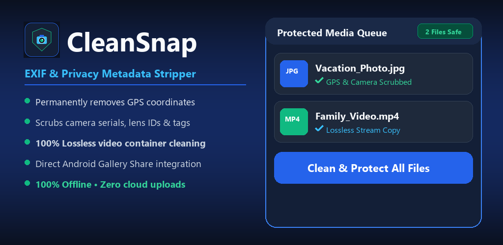

# ✨ CleanSnap — Multiplatform EXIF & Privacy Metadata Stripper

<p align="center">
  
</p>

<p align="center">
  <a href="https://bonikaeu-svg.github.io/CleanSnap/"></a>
  <a href="https://bonikaeu-svg.github.io/CleanSnap/"></a>
  <a href="https://bonikaeu-svg.github.io/CleanSnap/CleanSnap.apk"></a>
  <a href="https://github.com/bonikaeu-svg/CleanSnap"></a>
  <a href="https://bonikaeu-svg.github.io/CleanSnap/privacy.html"></a>
  
</p>

A friendly, modern, and lightning-fast privacy application to permanently strip all EXIF metadata, GPS coordinates, device serials, and container tags from photos and videos before sharing them online.

---

## 🌐 Try in Browser or Download

| Platform | Link | Details |
| :--- | :--- | :--- |
| **🌐 Web App (PWA)** | **[bonikaeu-svg.github.io/CleanSnap](https://bonikaeu-svg.github.io/CleanSnap/)** | Runs 100% in browser (mobile & desktop), zero installation |
| **🤖 Android (.apk)** | **[Download CleanSnap.apk](https://bonikaeu-svg.github.io/CleanSnap/CleanSnap.apk)** | Native Jetpack Compose app (16.4 MB) |
| **📦 Google Play (.aab)** | **[`CleanSnap_PlayStore.aab`](CleanSnap_PlayStore.aab)** | Google Play Store bundle with R8 minification |
| **💻 Windows (.exe)** | **[`CleanSnap.exe`](file:///c:/Users/Kiton/Documents/antigravity/kind-bardeen/CleanSnap.exe)** | Standalone desktop application with High-DPI support |

---

## ⚡ Direct Executable (`CleanSnap.exe`)

You have a standalone Windows executable ready to run:

👉 **Double-click [`CleanSnap.exe`](file:///c:/Users/Kiton/Documents/antigravity/kind-bardeen/CleanSnap.exe)** directly in this folder!

- **Zero setup required**: No Python installation or command-line commands needed.
- **Self-contained**: Bundles PyQt6, Pillow, HEIC support, and static FFmpeg inside a single `.exe`.
- **Completely offline**: Never uploads or sends your media anywhere. Everything runs locally on your PC.

---

## ✨ Friendly Interface Highlights

- **📥 Inviting Drag & Drop Area**: Drop photos, videos, or entire folders into the window.
- **📍 Smart Privacy Leak Alert**: Immediately flags files that contain GPS locations and shows where they are located.
- **🔍 Friendly Metadata Inspector**: Double-click or click **"Inspect"** to view camera hardware, lens details, timestamps, and open GPS coordinates directly in Google Maps.
- **🛡️ 100% Lossless Video Scrubbing**: Uses stream-copy mode (`-c copy`) — no video transcoding, zero loss of visual quality, and instant execution.
- **📸 Smart Photo Orientation Transpose**: Bakes orientation into pixels before stripping EXIF so photos are never sideways or flipped.
- **🌐 Bilingual UI**: Instant 1-click toggle between 🇷🇺 Russian and 🇬🇧 English across Windows, Android, and Web.
- **🎉 Celebratory Completion**: Displays a clean summary of protected files, saved storage, and provides a direct 1-click button to open your output folder.

---

## 🚀 Running from Source (Optional)

If you prefer running from Python:

```powershell
# Launch GUI
python app.py

# Or use the quick batch launcher
run_app.bat
```

### Command-Line Interface (CLI)
```powershell
# Inspect files in terminal without changing them
python cli.py -i photo.jpg video.mp4 --inspect

# Clean files into a target directory
python cli.py -i my_folder/ -o cleaned_media/
```

---

## 🔨 Rebuilding the `.exe`

To rebuild the standalone executable from source at any time:
```powershell
python build_exe.py
```
This generates the standalone binary in `dist/CleanSnap.exe`.
